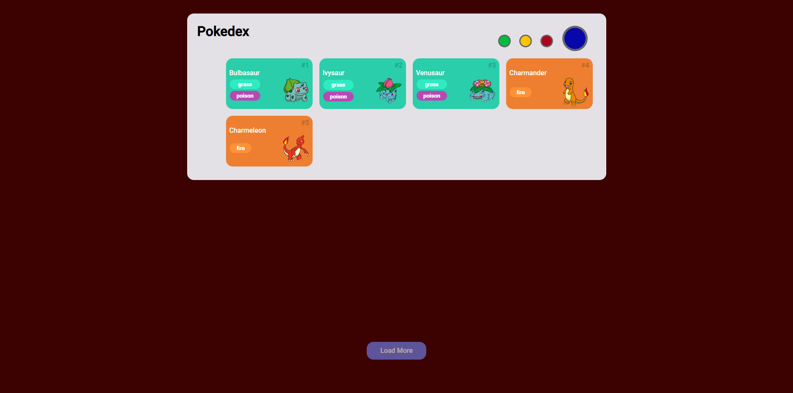
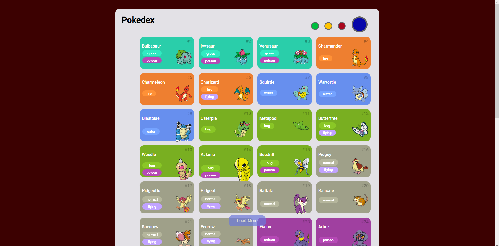
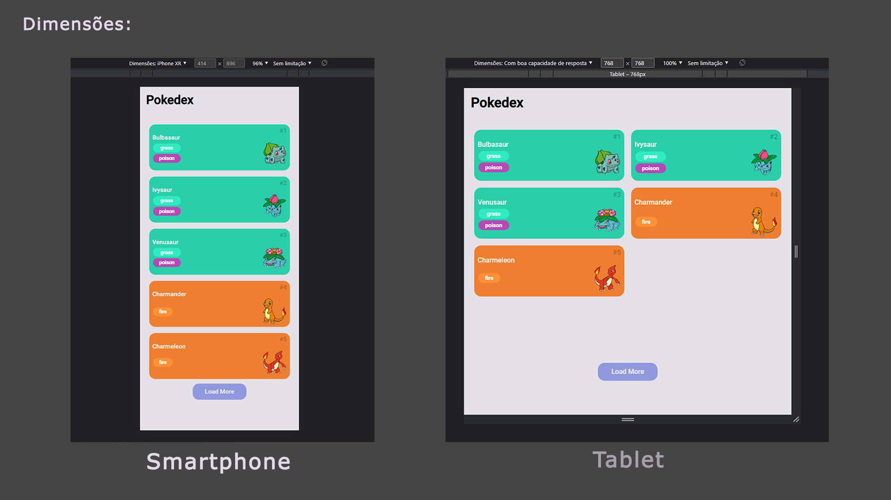

## Pokedex - DIO - <a href="https://thanaracs.github.io/pokedex-javascript-dio/">Clique aqui.</a>
Pokedex realizada no bootcamp Orange Tech, na plataforma da DIO.me  
Foram utilizadas as tecnologias: HTML, CSS E Javascript, também foi utilizada a PokeApi.  
link: <a href="https://pokeapi.co">PokeAPI</a> e <a href="https://web.dio.me/track/orange-tech">Dio.me</a>
     

   

   

  

